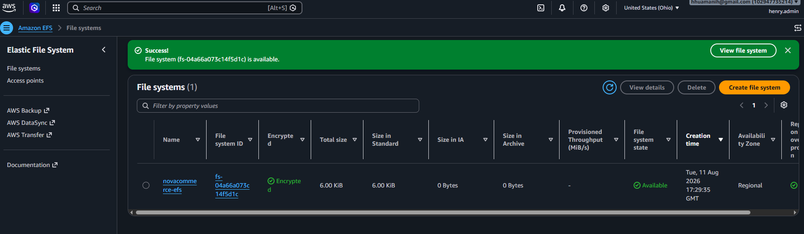
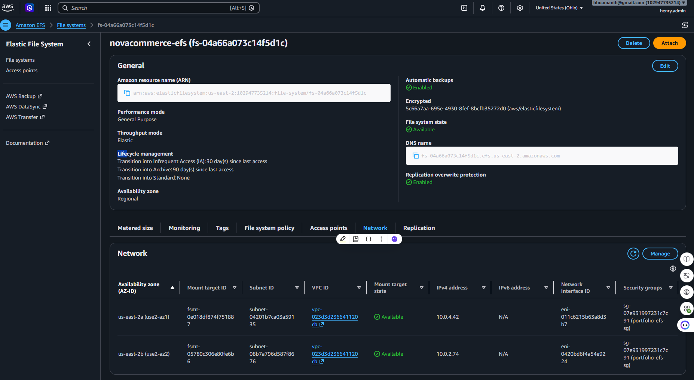
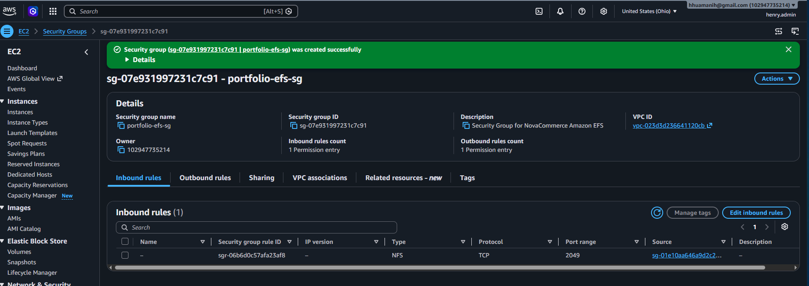
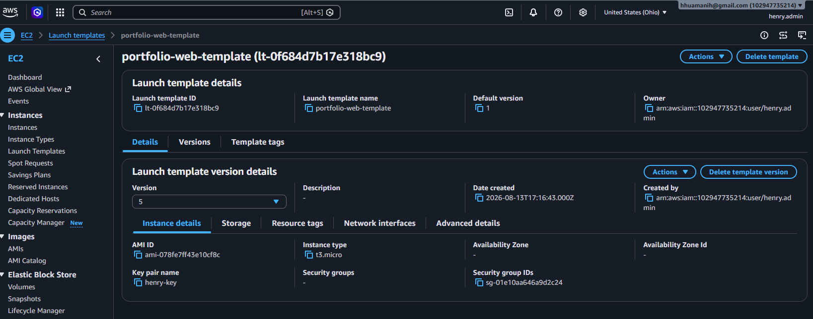
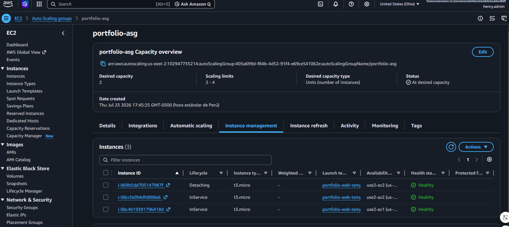
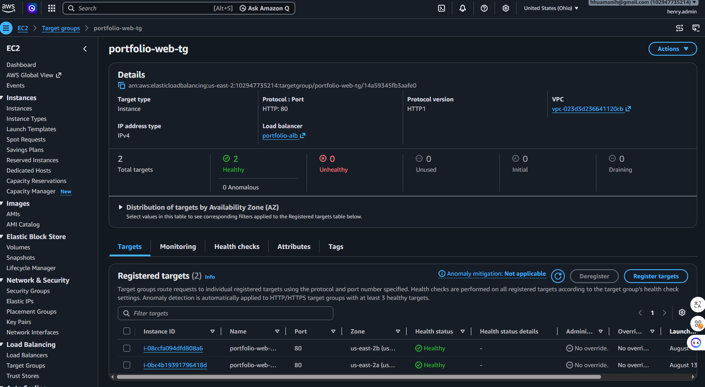
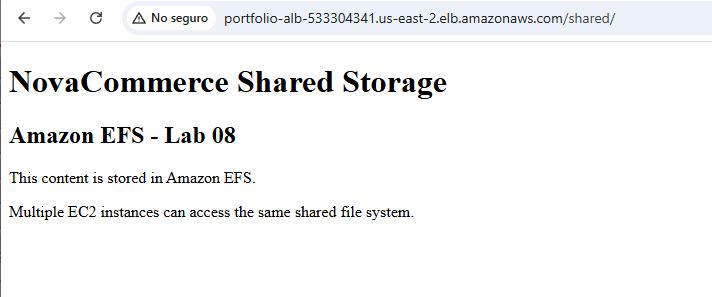

# Lab 08 -- Amazon Elastic File System (EFS)

> **Difficulty:** Intermediate\
> **Category:** Storage / High Availability\
> **Status:** ✅ Completed\
> **Estimated Time:** 3--4 hours

------------------------------------------------------------------------

# Overview

This laboratory integrates Amazon Elastic File System (Amazon EFS) into
the existing NovaCommerce highly available AWS architecture.

The infrastructure developed in previous laboratories already provides
traffic distribution through an Application Load Balancer, automatic EC2
capacity management through an Auto Scaling Group, and relational data
persistence through Amazon RDS.

However, application files stored locally on individual EC2 instances
are not suitable for an Auto Scaling environment because instances can
be replaced at any time.

Amazon EFS solves this challenge by providing a managed, scalable,
regional Network File System (NFS) that can be mounted simultaneously by
multiple EC2 instances.

In this laboratory, Amazon EFS was integrated with the existing EC2 Auto
Scaling environment and automated through an EC2 Launch Template.

The final implementation demonstrates that a replacement EC2 instance
can automatically mount the existing EFS file system and immediately
access the same shared application content.

------------------------------------------------------------------------

# Learning Objectives

By completing this laboratory, you will be able to:

-   Understand the purpose of Amazon Elastic File System.
-   Create a Regional Amazon EFS file system.
-   Configure EFS Mount Targets across multiple Availability Zones.
-   Configure Security Groups for NFS communication.
-   Mount Amazon EFS on Amazon EC2.
-   Configure persistent EFS mounts using `/etc/fstab`.
-   Automate EFS integration through EC2 User Data.
-   Integrate Amazon EFS with an EC2 Launch Template.
-   Integrate shared storage with an Auto Scaling Group.
-   Validate EFS access after automatic EC2 instance replacement.
-   Validate shared application content through an Application Load
    Balancer.
-   Apply security and high-availability best practices.

------------------------------------------------------------------------

# Business Scenario

NovaCommerce has evolved into a highly available cloud architecture
running multiple Amazon EC2 instances behind an Application Load
Balancer and managed by an Auto Scaling Group.

Customer and transactional information is stored in Amazon RDS, but
application files stored locally on EC2 instances introduce an important
architectural limitation.

EC2 instances managed by Auto Scaling are ephemeral. They can be
launched, terminated, or replaced automatically.

Therefore, application files cannot depend on the local storage of a
specific EC2 instance.

NovaCommerce requires a shared storage layer that:

-   Can be accessed by multiple EC2 instances.
-   Remains available when EC2 instances are replaced.
-   Supports multiple Availability Zones.
-   Integrates with Auto Scaling.
-   Provides persistent application storage.

Amazon Elastic File System was selected to provide this shared storage
layer.

------------------------------------------------------------------------

# Solution Overview

Amazon EFS was integrated into the existing NovaCommerce infrastructure
as centralized shared storage for the application tier.

The implementation includes:

-   A Regional Amazon EFS file system.
-   EFS Mount Targets in multiple Availability Zones.
-   A dedicated Security Group for NFS traffic.
-   EFS mounting on EC2 instances.
-   Persistent mount configuration using `/etc/fstab`.
-   Automated EFS configuration through EC2 User Data.
-   EC2 Launch Template integration.
-   Auto Scaling instance replacement validation.
-   Application Load Balancer validation.
-   Shared application content exposed through `/shared/`.

This architecture allows EC2 instances to be replaced without losing
access to application files stored in Amazon EFS.

------------------------------------------------------------------------

# AWS Services Used

  -----------------------------------------------------------------------
  AWS Service                               Purpose
  ----------------------------------------- -----------------------------
  Amazon EFS                                Provides shared and
                                            persistent file storage

  Amazon EC2                                Hosts the NovaCommerce web
                                            application

  EC2 Launch Template                       Defines automated instance
                                            configuration

  EC2 Auto Scaling                          Maintains application
                                            capacity and replaces
                                            instances

  Application Load Balancer                 Distributes HTTP traffic
                                            across healthy EC2 instances

  Target Groups                             Performs health checks and
                                            routes traffic to EC2
                                            instances

  AWS Systems Manager                       Provides administrative
                                            access to EC2 instances

  Amazon RDS                                Provides relational database
                                            persistence

  Amazon VPC                                Provides network isolation

  Security Groups                           Control HTTP and NFS
                                            communication
  -----------------------------------------------------------------------

------------------------------------------------------------------------

# Architecture

The following diagram represents the architecture implemented in this
laboratory.


## Editable Diagram

``` text
diagrams/lab-08-efs-architecture.drawio
```

The logical architecture can be represented as:

``` text
                         Internet
                            │
                            ▼
                Application Load Balancer
                     portfolio-alb
                            │
                            ▼
                    Target Group
                   portfolio-web-tg
                     │          │
                     │          │
                     ▼          ▼
                 EC2 Instance  EC2 Instance
                  us-east-2a    us-east-2b
                     │          │
                     └────┬─────┘
                          │
                      NFS TCP/2049
                          │
                          ▼
                  Amazon EFS Regional
                   novacommerce-efs
                     │          │
                     ▼          ▼
                 Mount Target Mount Target
                  us-east-2a   us-east-2b
```

------------------------------------------------------------------------

# Architecture Components

  -----------------------------------------------------------------------
  Component                        Description
  -------------------------------- --------------------------------------
  Amazon VPC                       Provides the isolated network used by
                                   the NovaCommerce infrastructure

  Public Subnets                   Host the application EC2 instances and
                                   load-balancing components

  Application Load Balancer        Distributes incoming HTTP requests

  Target Group                     Routes requests to healthy EC2
                                   instances

  Auto Scaling Group               Maintains the desired EC2 capacity

  EC2 Launch Template              Automates the configuration of
                                   replacement instances

  Amazon EC2                       Runs the Apache web application

  Amazon EFS                       Provides shared persistent storage

  EFS Mount Targets                Provide network access to EFS from
                                   each Availability Zone

  Amazon RDS MySQL                 Stores relational application data

  Security Groups                  Restrict HTTP and NFS network
                                   communication
  -----------------------------------------------------------------------

------------------------------------------------------------------------

# Network Flow

Application traffic follows this path:

``` text
User
 │
 ▼
Application Load Balancer
 │
 ▼
Target Group
 │
 ├───────────────┐
 ▼               ▼
EC2             EC2
AZ 2a           AZ 2b
 │               │
 └───────┬───────┘
         │
         │ NFS TCP/2049
         ▼
     Amazon EFS
```

The Application Load Balancer distributes HTTP requests across healthy
EC2 instances.

Each EC2 instance mounts the same Amazon EFS file system.

Because the application servers use shared storage, the requested
content remains available regardless of which EC2 instance receives the
request.

------------------------------------------------------------------------

# Architecture Evolution

The NovaCommerce cloud architecture has evolved incrementally throughout
the portfolio.

  Laboratory   Architecture Evolution
  ------------ -------------------------------
  Lab 01       IAM users and permissions
  Lab 02       Amazon EC2
  Lab 03       Amazon S3
  Lab 04       Amazon VPC
  Lab 05       Application Load Balancer
  Lab 06       Auto Scaling Group
  Lab 07       Amazon RDS
  **Lab 08**   **Amazon EFS Shared Storage**

The architecture now supports:

-   High availability.
-   Horizontal scalability.
-   Relational database persistence.
-   Shared persistent file storage.
-   Automatic EC2 instance replacement.
-   Multi-AZ application deployment.

------------------------------------------------------------------------

# Architecture Decisions

Detailed architectural decisions are documented in:

``` text
architecture/architecture-decisions.md
```

The main design decisions implemented in this laboratory include:

-   Amazon EFS was selected because multiple EC2 instances require
    concurrent access to the same files.
-   A Regional EFS deployment was used to support a Multi-AZ
    architecture.
-   Mount Targets were deployed across the Availability Zones used by
    the application.
-   NFS traffic is restricted using Security Groups.
-   EFS configuration is automated through the EC2 Launch Template.
-   Shared application storage is independent of the lifecycle of
    individual EC2 instances.

------------------------------------------------------------------------

# Prerequisites

Before starting this laboratory, the following resources must already
exist:

-   Amazon VPC.
-   Public subnets across multiple Availability Zones.
-   Internet Gateway.
-   Route Tables.
-   Security Groups.
-   Application Load Balancer.
-   Target Group.
-   Auto Scaling Group.
-   EC2 Launch Template.
-   Amazon EC2 instances.
-   Amazon RDS.

These components were created in previous laboratories and reused in
this implementation.

------------------------------------------------------------------------

# Implementation

The Amazon EFS integration was implemented in ten phases.

------------------------------------------------------------------------

## Phase 1 -- Create the Amazon EFS File System

A Regional Amazon EFS file system named `novacommerce-efs` was created
inside the existing NovaCommerce VPC.

The file system was configured with encryption enabled and automatic
backups.

### Configuration

  Property            Value
  ------------------- ------------------------
  File System         `novacommerce-efs`
  File System ID      `fs-04a66a073c14f5d1c`
  Availability        Regional
  Performance Mode    General Purpose
  Throughput Mode     Elastic
  Encryption          Enabled
  Automatic Backups   Enabled

### Evidence



------------------------------------------------------------------------

## Phase 2 -- Configure EFS Mount Targets

Mount Targets were configured to provide network connectivity between
EC2 instances and Amazon EFS.

The implementation includes Mount Targets in both Availability Zones
used by the application:

-   `us-east-2a`
-   `us-east-2b`

Both Mount Targets reached the `Available` state.

This configuration allows application servers in multiple Availability
Zones to access the same Regional EFS file system.

### Evidence



------------------------------------------------------------------------

## Phase 3 -- Configure the EFS Security Group

A dedicated Security Group named `portfolio-efs-sg` was created for
Amazon EFS.

Inbound NFS communication uses:

``` text
Protocol: TCP
Port: 2049
Source: Application EC2 Security Group
```

Instead of allowing NFS access from the entire Internet or VPC CIDR
range, the rule references the Security Group associated with the
application servers.

This follows the principle of least privilege.

### Evidence



------------------------------------------------------------------------

## Phase 4 -- Integrate EFS with the EC2 Launch Template

The existing EC2 Launch Template was updated to automate Amazon EFS
configuration.

A new Launch Template version was created for the EFS integration.

The Auto Scaling Group was configured to use:

``` text
Launch Template: portfolio-web-template
Version: 5
Instance Type: t3.micro
```

### Evidence



------------------------------------------------------------------------

## Phase 5 -- Automate the EFS Mount with User Data

The Launch Template User Data was configured to automatically prepare
every new EC2 instance.

The initialization process performs the following tasks:

1.  Installs Apache HTTP Server.
2.  Installs `amazon-efs-utils`.
3.  Creates `/mnt/efs`.
4.  Adds the EFS configuration to `/etc/fstab`.
5.  Mounts Amazon EFS using TLS.
6.  Creates `/mnt/efs/shared`.
7.  Creates the Apache symbolic link `/var/www/html/shared`.
8.  Starts the Apache service.

The persistent mount configuration uses:

``` text
fs-04a66a073c14f5d1c:/ /mnt/efs efs _netdev,tls 0 0
```

This allows replacement EC2 instances to automatically reconnect to the
existing shared storage.

### Evidence

The EFS automation is implemented directly in the EC2 Launch Template
User Data.

The bootstrap configuration installs the required packages, configures
the persistent EFS mount, mounts the shared file system, and exposes the
shared directory through Apache.

The complete bootstrap script used by the EC2 Launch Template is
available at:

[`scripts/script.sh`](scripts/script.sh)

The successful execution of this automation is validated in the
following phase, where a newly launched Auto Scaling instance
automatically mounts Amazon EFS without manual configuration.

------------------------------------------------------------------------

## Phase 6 -- Validate EFS on an Auto Scaling Instance

A newly launched Auto Scaling instance was inspected using AWS Systems
Manager Session Manager.

The following commands were used to validate the configuration:

``` bash
rpm -q amazon-efs-utils

df -hT | grep efs

grep efs /etc/fstab

ls -lah /var/www/html/

cat /mnt/efs/shared/index.html

curl http://localhost/shared/
```

The validation confirmed that:

-   `amazon-efs-utils` was installed.
-   Amazon EFS was mounted at `/mnt/efs`.
-   The mount configuration was stored in `/etc/fstab`.
-   The shared directory was available.
-   Apache could serve the shared content.

### Evidence


------------------------------------------------------------------------

## Phase 7 -- Validate Shared EFS Storage Across EC2 Instances

After confirming that Amazon EFS was automatically mounted on the Auto
Scaling instances, the next validation was to verify that multiple EC2
instances could access the same shared content.

Two different EC2 instances were used for this test.

On each instance, the EFS filesystem and shared application directory
were validated using commands such as:

``` bash
hostname
df -hT | grep efs
ls -lah /mnt/efs/shared/
cat /mnt/efs/shared/index.html
curl http://localhost/shared/
```

Both EC2 instances successfully accessed the same `index.html` file
stored under:

``` text
/mnt/efs/shared/
```

The Apache web directory was connected to the shared EFS directory
through:

``` text
/var/www/html/shared -> /mnt/efs/shared
```

This demonstrates that the application instances do not depend on their
local filesystems for shared application content.

Instead, multiple EC2 instances can access the same persistent data
stored in Amazon EFS.

### Evidence


------------------------------------------------------------------------

## Phase 8 -- Validate Auto Scaling Instance Replacement

A running EC2 instance was intentionally detached from the Auto Scaling
Group with instance replacement enabled.

Because the desired capacity was configured as two instances, Auto
Scaling detected that the actual capacity had fallen below the desired
capacity.

A new EC2 instance was automatically launched.

The Auto Scaling Activity History confirmed:

``` text
Detaching EC2 instance
```

followed by:

``` text
Launching a new EC2 instance
```

The replacement instance was created using the updated Launch Template
and automatically configured Amazon EFS.

### Evidence


The Auto Scaling Group also showed healthy replacement instances
operating across the configured Availability Zones.



------------------------------------------------------------------------

## Phase 9 -- Validate Target Group Health

After the replacement process completed, the Application Load Balancer
Target Group was validated.

The final Target Group contained two registered EC2 instances.

Both instances reported:

``` text
Health Status: Healthy
```

The instances were distributed across:

``` text
us-east-2a
us-east-2b
```

The final status was:

  Metric               Result
  -------------------- --------
  Total Targets        2
  Healthy              2
  Unhealthy            0
  Availability Zones   2

### Evidence



------------------------------------------------------------------------

## Phase 10 -- Validate Shared Content through the Application Load Balancer

The final validation was performed through the public DNS name of the
Application Load Balancer.

The shared application path was accessed using:

``` text
http://<ALB-DNS-NAME>/shared/
```

The Application Load Balancer successfully returned the content stored
in Amazon EFS:

``` text
NovaCommerce Shared Storage

Amazon EFS - Lab 08

This content is stored in Amazon EFS.

Multiple EC2 instances can access the same shared file system.
```

This validates the complete application path:

``` text
Internet
   │
   ▼
Application Load Balancer
   │
   ▼
Target Group
   │
   ▼
Auto Scaling EC2 Instance
   │
   ▼
/var/www/html/shared
   │
   ▼
/mnt/efs/shared
   │
   ▼
Amazon EFS
```

### Evidence



------------------------------------------------------------------------

# Final Validation

The Amazon EFS integration was successfully validated.

## Acceptance Criteria

  Validation                                              Status
  ------------------------------------------------------ --------
  Amazon EFS created successfully                           ✅
  Encryption enabled                                        ✅
  Regional EFS configuration                                ✅
  Mount Target available in `us-east-2a`                    ✅
  Mount Target available in `us-east-2b`                    ✅
  NFS TCP/2049 restricted by Security Group                 ✅
  `amazon-efs-utils` installed automatically                ✅
  EFS mounted at `/mnt/efs`                                 ✅
  Persistent mount configured in `/etc/fstab`               ✅
  Shared directory available to Apache                      ✅
  Launch Template updated                                   ✅
  Auto Scaling replacement validated                        ✅
  Replacement instance mounted EFS automatically            ✅
  Multiple EC2 instances accessed the same EFS content      ✅
  Two Target Group instances healthy                        ✅
  Shared content accessible through ALB                     ✅

------------------------------------------------------------------------

# Validation Evidence

  --------------------------------------------------------------------------------
  Evidence                                Description
  --------------------------------------- ----------------------------------------
  `01-efs-created.png`                    Amazon EFS creation and availability

  `02-efs-mount-targets.png`              Multi-AZ EFS Mount Targets

  `03-efs-security-group.png`             NFS TCP/2049 Security Group
                                          configuration

  `04-launch-template-v5.png`             EC2 Launch Template version used by the
                                          ASG

  `05-asg-instances-healthy.png`          Auto Scaling instance lifecycle
                                          validation

  `06-efs-mounted-new-instance.png`       EFS automatically mounted on a
                                          replacement instance

  `07-efs-shared-between-instances.png`   Shared EFS content accessed from two
                                          different EC2 instances

  `08-asg-instance-replacement.png`       Auto Scaling Activity History showing
                                          instance replacement

  `09-target-group-healthy.png`           Two healthy targets across multiple
                                          Availability Zones

  `10-alb-efs-shared-page.png`            Shared EFS content successfully accessed
                                          through the ALB
  --------------------------------------------------------------------------------

------------------------------------------------------------------------

# Troubleshooting

## Issue 1 -- SSH Connectivity Failed

### Problem

Direct SSH connectivity to one EC2 instance initially timed out even
though the SSH service was running.

### Investigation

Connectivity tests were performed from the client:

``` powershell
Test-NetConnection <EC2-PUBLIC-IP> -Port 22
```

The SSH service was also validated from the instance using AWS Systems
Manager Session Manager.

The source public IP observed by the EC2 instance was different from the
expected client public IP.

### Root Cause

The Security Group SSH rule did not initially match the actual public
source IP used by the client connection.

### Resolution

The correct public source IP was identified and the Security Group rule
was adjusted.

SSH connectivity was successfully restored.

### Lesson Learned

Always validate the actual public source IP used by the client before
troubleshooting the EC2 operating system or SSH daemon.

------------------------------------------------------------------------

## Issue 2 -- `/shared/` Returned `Not Found` through the ALB

### Problem

The shared page worked locally on the EC2 instance:

``` bash
curl http://localhost/shared/
```

but accessing the same path through the Application Load Balancer
returned:

``` text
Not Found
The requested URL was not found on this server.
```

### Investigation

The EFS mount and symbolic link were validated on the new EC2 instances.

The Target Group was then reviewed.

Several older EC2 instances were still registered as targets.

Some of those instances did not contain the updated EFS `/shared/`
configuration.

Because the Application Load Balancer distributed requests across all
registered healthy targets, requests could reach an instance without the
shared path.

### Root Cause

Old EC2 instances remained registered in the Target Group after the EFS
configuration was introduced.

### Resolution

The obsolete targets were deregistered.

The Target Group was reduced to the two current Auto Scaling instances,
both configured with the updated Launch Template.

After deregistration, the `/shared/` path was successfully served
through the Application Load Balancer.

### Lesson Learned

A healthy Target Group status only confirms that the configured health
check succeeds.

It does not guarantee that every application path is configured
identically across all registered targets.

Configuration consistency across Auto Scaling instances is essential.

------------------------------------------------------------------------

# Security Considerations

The following security controls were implemented:

-   Amazon EFS encryption at rest is enabled.
-   EFS communication uses TLS.
-   NFS access is restricted to TCP port `2049`.
-   The EFS Security Group accepts NFS traffic only from the application
    Security Group.
-   No public access is required for the EFS file system.
-   EC2 administrative access can be performed through AWS Systems
    Manager.
-   Application traffic is distributed through the Application Load
    Balancer.
-   Security Group references are preferred over broad CIDR-based NFS
    rules.
-   The architecture follows the principle of least privilege.

------------------------------------------------------------------------

# Best Practices

The following AWS best practices were applied:

-   Use Regional Amazon EFS for workloads requiring Multi-AZ
    availability.
-   Deploy Mount Targets in the Availability Zones used by application
    instances.
-   Restrict NFS traffic using Security Group references.
-   Avoid storing persistent application files on ephemeral Auto Scaling
    instances.
-   Automate instance configuration through Launch Templates and User
    Data.
-   Configure persistent EFS mounts using `/etc/fstab`.
-   Use `_netdev` for network-dependent file systems.
-   Use TLS for EFS connections.
-   Validate replacement instances before considering Auto Scaling
    integration complete.
-   Keep Target Group membership consistent with the current Auto
    Scaling environment.

------------------------------------------------------------------------

# Key Takeaways

-   EC2 instances in an Auto Scaling Group should be treated as
    replaceable infrastructure.
-   Local EC2 storage should not be used for application data that must
    survive instance replacement.
-   Amazon EFS provides shared file storage accessible from multiple EC2
    instances.
-   EFS Mount Targets provide network access to the file system from
    different Availability Zones.
-   NFS uses TCP port `2049`.
-   Security Groups can securely control access between EC2 and EFS.
-   Launch Templates can automate EFS installation and mounting.
-   `/etc/fstab` provides persistent mount configuration.
-   Auto Scaling can replace an EC2 instance without losing shared
    application data stored in EFS.
-   Application Load Balancer health checks do not guarantee that every
    application path is identical across all targets.
-   Shared storage decouples persistent application files from EC2
    instance lifecycle.

------------------------------------------------------------------------

# Skills Demonstrated

## AWS

-   Amazon EFS
-   Amazon EC2
-   EC2 Launch Templates
-   EC2 Auto Scaling
-   Application Load Balancer
-   Target Groups
-   AWS Systems Manager
-   Amazon VPC
-   Security Groups

## Storage

-   Network File System (NFS)
-   Shared storage
-   Persistent storage
-   Multi-AZ file systems
-   EFS Mount Targets

## Networking

-   TCP/IP
-   NFS TCP/2049
-   Security Group references
-   Multi-AZ connectivity
-   Load balancing

## Security

-   Least privilege
-   Encryption at rest
-   Encryption in transit
-   Security Group isolation
-   Restricted NFS access

## Linux

-   `amazon-efs-utils`
-   `mount`
-   `/etc/fstab`
-   Symbolic links
-   Apache HTTP Server
-   `curl`
-   Linux package management

## DevOps

-   Infrastructure automation
-   EC2 User Data
-   Immutable and replaceable compute concepts
-   Auto Scaling instance replacement
-   Automated bootstrap configuration
-   High-availability validation
-   Troubleshooting distributed infrastructure

------------------------------------------------------------------------

# Repository Structure

``` text
08-EFS/
│
├── README.md
├── CHANGELOG.md
├── commands.md
├── interview-questions.md
├── resources.md
├── study-notes.md
├── troubleshooting.md
│
├── architecture/
│   ├── README.md
│   ├── architecture-decisions.md
│   └── lab-08-efs-architecture.png
│
├── diagrams/
│   └── lab-08-efs-architecture.drawio
│
├── evidence/
│   ├── 01-efs-created.png
│   ├── 02-efs-mount-targets.png
│   ├── 03-efs-security-group.png
│   ├── 04-launch-template-v5.png
│   ├── 05-asg-instances-healthy.png
│   ├── 06-efs-mounted-new-instance.png
│   ├── 07-efs-shared-between-instances.png
│   ├── 08-asg-instance-replacement.png
│   ├── 09-target-group-healthy.png
│   └── 10-alb-efs-shared-page.png
│
└── scripts/
    └── script.sh
```

------------------------------------------------------------------------

# References

## AWS Documentation

-   Amazon Elastic File System Documentation
-   Mounting Amazon EFS File Systems
-   Amazon EFS Security Groups
-   Amazon EC2 Auto Scaling Documentation
-   EC2 Launch Templates Documentation
-   Application Load Balancer Documentation
-   AWS Systems Manager Session Manager Documentation

------------------------------------------------------------------------

# Conclusion

Lab 08 successfully integrated Amazon Elastic File System with the
existing NovaCommerce highly available architecture.

The implementation demonstrated that application files can be decoupled
from the lifecycle of individual EC2 instances by using shared
persistent storage.

Amazon EFS was deployed across multiple Availability Zones, secured
using Security Groups, mounted automatically through EC2 User Data, and
integrated with the Auto Scaling Group through an updated Launch
Template.

The most important validation was the replacement of an existing EC2
instance.

Auto Scaling automatically launched a new instance, the new instance
mounted the existing EFS file system, the Target Group reported the
replacement instances as healthy, and the shared application content
remained accessible through the Application Load Balancer.

This demonstrates a fundamental cloud architecture principle:

> **Compute instances can be ephemeral while application data remains
> persistent and shared.**

------------------------------------------------------------------------

**Lab Status:** ✅ Completed
