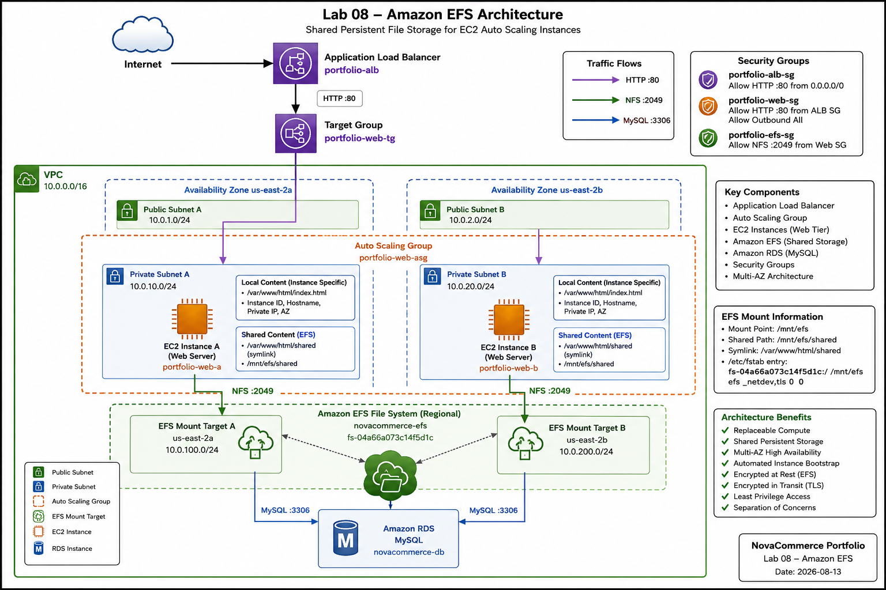

# Lab 08 – Amazon EFS Architecture

## Architecture Overview

This directory contains the architecture documentation for **Lab 08 – Amazon Elastic File System (EFS)**.

The laboratory extends the existing NovaCommerce highly available AWS architecture by introducing Amazon EFS as a shared and persistent file storage layer for EC2 instances managed by an Auto Scaling Group.

The main architectural objective is to separate persistent application files from the lifecycle of individual EC2 instances.

---

# Architecture Diagram



The editable version of the architecture diagram is available at:

```text
../diagrams/lab-08-efs-architecture.drawio
```

---

# High-Level Architecture

```text
                            Internet
                               │
                               ▼
                   Application Load Balancer
                        portfolio-alb
                               │
                               ▼
                         Target Group
                       portfolio-web-tg
                         │           │
                         ▼           ▼
                    EC2 Instance  EC2 Instance
                     us-east-2a    us-east-2b
                         │           │
                         └─────┬─────┘
                               │
                         NFS TCP/2049
                               │
                               ▼
                         Amazon EFS
                      novacommerce-efs
                         │           │
                         ▼           ▼
                    Mount Target  Mount Target
                     us-east-2a    us-east-2b


                    Application Tier
                           │
                           ▼
                      Amazon RDS
                         MySQL
```

---

# Architecture Layers

The architecture can be divided into five main layers.

## 1. Entry Layer

The Application Load Balancer provides the public entry point for the web application.

```text
Internet
   │
   ▼
Application Load Balancer
```

The load balancer distributes HTTP traffic across healthy EC2 instances.

---

## 2. Compute Layer

The application runs on Amazon EC2 instances managed by an Auto Scaling Group.

```text
Auto Scaling Group
      │
      ├── EC2 – us-east-2a
      │
      └── EC2 – us-east-2b
```

The EC2 instances are treated as replaceable compute resources.

The Auto Scaling Group maintains the required application capacity and automatically launches replacement instances when necessary.

---

## 3. Shared Storage Layer

Amazon EFS provides shared persistent file storage.

```text
EC2-A ─────┐
           │
           ▼
       Amazon EFS
           ▲
           │
EC2-B ─────┘
```

Both application instances can access the same files.

The EFS file system used in this laboratory is:

```text
Name: novacommerce-efs
File System ID: fs-04a66a073c14f5d1c
```

---

## 4. Database Layer

Amazon RDS provides persistent relational database storage for the application.

This creates a separation between different types of persistent data:

```text
Application Files
       │
       ▼
   Amazon EFS


Relational Data
       │
       ▼
   Amazon RDS
```

---

## 5. Automation Layer

The EC2 Launch Template defines how new application instances are configured.

The EFS-enabled configuration uses:

```text
Launch Template: portfolio-web-template
Version: 5
```

User Data automatically performs:

```text
Install Apache
      │
      ▼
Install amazon-efs-utils
      │
      ▼
Create /mnt/efs
      │
      ▼
Configure /etc/fstab
      │
      ▼
Mount Amazon EFS
      │
      ▼
Create /mnt/efs/shared
      │
      ▼
Create Apache symbolic link
      │
      ▼
Validate services
```

This ensures that replacement instances can automatically reconnect to the shared file system.

---

# Network Architecture

Amazon EFS is accessed through Mount Targets located inside the VPC.

The application uses two Availability Zones:

```text
us-east-2a
us-east-2b
```

The EFS architecture is:

```text
Availability Zone us-east-2a
        │
        ├── EC2 Instance
        │
        └── EFS Mount Target


Availability Zone us-east-2b
        │
        ├── EC2 Instance
        │
        └── EFS Mount Target
```

Both Mount Targets provide access to the same Regional EFS file system.

---

# Security Architecture

Amazon EFS uses a dedicated Security Group:

```text
portfolio-efs-sg
```

The required NFS communication is:

```text
Protocol: TCP
Port: 2049
Source: Application EC2 Security Group
```

Conceptually:

```text
EC2 Security Group
        │
        │ NFS TCP/2049
        ▼
EFS Security Group
        │
        ▼
    Amazon EFS
```

The EFS Security Group does not require public NFS access.

---

# Storage Architecture

The EC2 instances mount Amazon EFS at:

```text
/mnt/efs
```

Shared application content is stored at:

```text
/mnt/efs/shared
```

Apache exposes this content through:

```text
/var/www/html/shared
```

using a symbolic link:

```text
/var/www/html/shared
        │
        └───────────────► /mnt/efs/shared
                                │
                                ▼
                            Amazon EFS
```

---

# Local vs Shared Content

The architecture intentionally separates local EC2 content from shared application content.

## Local EC2 Content

```text
/var/www/html/index.html
```

Contains instance-specific information such as:

- Instance ID.
- Hostname.
- Private IP.
- Availability Zone.

Each EC2 instance can therefore display different metadata.

---

## Shared EFS Content

```text
/mnt/efs/shared/index.html
```

Contains persistent application content.

The same file is available to all EC2 instances that mount the EFS file system.

---

# Request Flow

A request for shared application content follows this path:

```text
User
 │
 ▼
Internet
 │
 ▼
Application Load Balancer
 │
 ▼
Target Group
 │
 ▼
Healthy EC2 Instance
 │
 ▼
Apache
 │
 ▼
/var/www/html/shared
 │
 ▼
Symbolic Link
 │
 ▼
/mnt/efs/shared
 │
 ▼
Amazon EFS
```

The user does not need to know which EC2 instance serves the request.

---

# Instance Replacement Flow

The architecture was validated by intentionally replacing an EC2 instance.

```text
Existing EC2
     │
     ▼
Detached from ASG
     │
     ▼
Actual Capacity < Desired Capacity
     │
     ▼
Auto Scaling launches new EC2
     │
     ▼
Launch Template v5
     │
     ▼
User Data executes
     │
     ▼
EFS mounted automatically
     │
     ▼
Existing shared files available
     │
     ▼
Target becomes Healthy
     │
     ▼
ALB routes traffic
```

This validates that application files are independent of the lifecycle of an individual EC2 instance.

---

# High Availability

The architecture combines several AWS services to improve availability:

| Component | High-Availability Role |
|-----------|------------------------|
| Application Load Balancer | Distributes traffic across application instances |
| Auto Scaling Group | Maintains required EC2 capacity |
| Multiple Availability Zones | Reduces dependency on a single AZ |
| Amazon EFS Regional | Provides shared Multi-AZ file storage |
| EFS Mount Targets | Provide EFS network access in each application AZ |
| Amazon RDS | Provides persistent relational storage |

---

# Failure Scenario

If one EC2 instance becomes unavailable:

```text
EC2-A ❌
   │
   ▼
Auto Scaling detects capacity change
   │
   ▼
New EC2 launched
   │
   ▼
Launch Template bootstrap
   │
   ▼
Amazon EFS mounted
   │
   ▼
Shared data available
   │
   ▼
Target becomes Healthy
```

The shared files remain stored in Amazon EFS throughout the process.

---

# Architecture Principles

The laboratory demonstrates the following cloud architecture principles.

## Replaceable Compute

```text
EC2 = Replaceable
```

Application instances should be reproducible through automation.

---

## Persistent Storage

```text
EFS = Persistent Shared Files

RDS = Persistent Relational Data
```

Persistent application state is separated from EC2.

---

## Multi-AZ Design

```text
AZ-A + AZ-B
```

Application resources are distributed across multiple Availability Zones.

---

## Least Privilege

Only authorized EC2 application instances can access EFS using:

```text
TCP 2049
```

---

## Automation

Launch Template User Data automatically prepares replacement instances.

---

# Architecture Validation

The final architecture was validated using the following tests:

| Test | Result |
|------|:------:|
| EFS File System Available | ✅ |
| Mount Target in `us-east-2a` | ✅ |
| Mount Target in `us-east-2b` | ✅ |
| NFS TCP/2049 Connectivity | ✅ |
| EFS Mounted on EC2 | ✅ |
| Persistent `/etc/fstab` Configuration | ✅ |
| Shared Content Available | ✅ |
| Launch Template Automation | ✅ |
| Auto Scaling Instance Replacement | ✅ |
| Replacement Instance EFS Mount | ✅ |
| Two Healthy ALB Targets | ✅ |
| `/shared/` Accessible through ALB | ✅ |

---

# Architecture Decisions

Detailed explanations for each architecture decision are available in:

```text
architecture-decisions.md
```

The document covers:

- Why Amazon EFS was selected.
- Why Regional EFS was used.
- Multi-AZ Mount Target design.
- Security Group strategy.
- Encryption at rest.
- TLS encryption in transit.
- Persistent mounting.
- Launch Template automation.
- Auto Scaling integration.
- Target Group management.
- Storage alternatives and trade-offs.

---

# Related Files

```text
architecture/
├── README.md
├── architecture-decisions.md
└── lab-08-efs-architecture.png

diagrams/
└── lab-08-efs-architecture.drawio
```

---

# Final Architecture Summary

Lab 08 extends the NovaCommerce architecture with a shared persistent storage layer.

The final design combines:

```text
Application Load Balancer
          +
Auto Scaling Group
          +
EC2 Launch Template
          +
Multiple EC2 Instances
          +
Amazon EFS
          +
Amazon RDS
```

The architecture separates:

```text
Traffic Distribution
        ↓
Application Load Balancer

Compute
        ↓
Auto Scaling + EC2

Shared Files
        ↓
Amazon EFS

Relational Data
        ↓
Amazon RDS
```

The result is an architecture where EC2 instances can be automatically replaced while shared application files remain persistent and accessible.