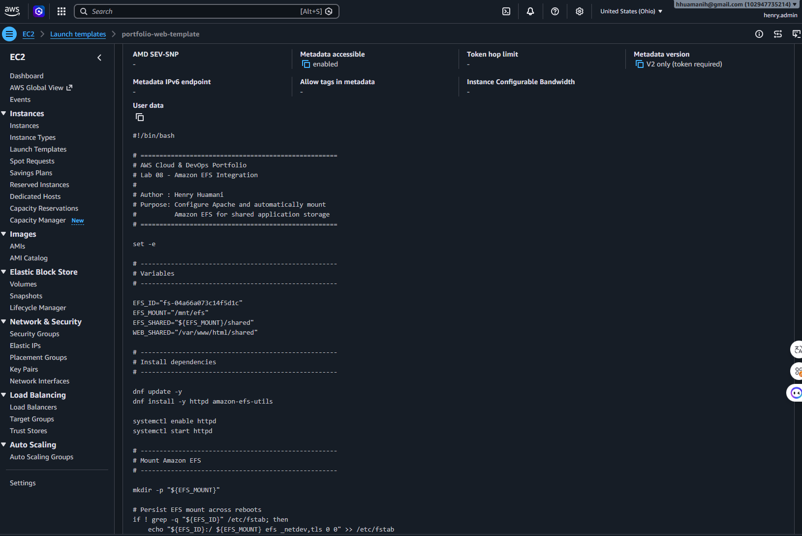
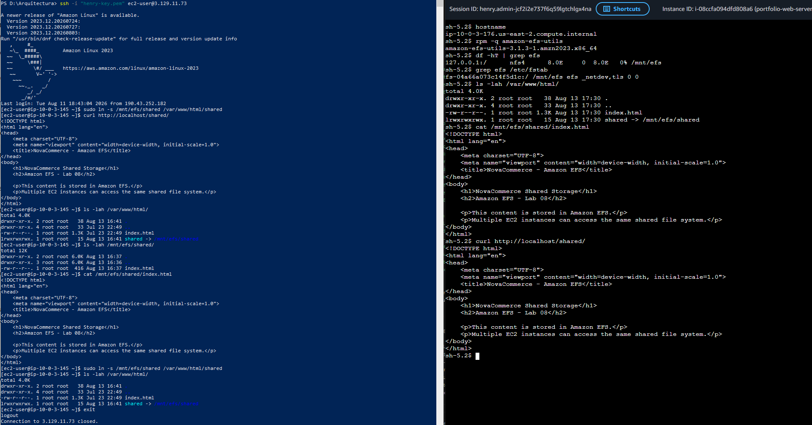
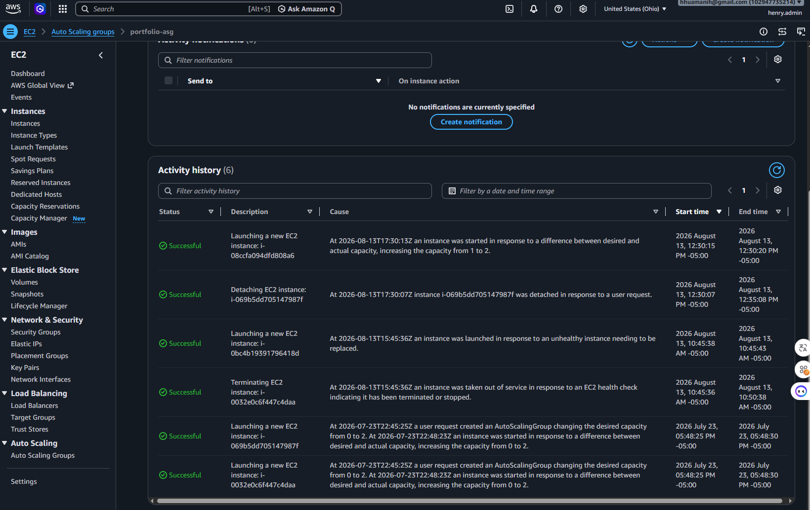

# Lab 08 – Amazon Elastic File System (EFS)

## Evidence

This directory contains the technical evidence collected during the implementation and validation of **Lab 08 – Amazon Elastic File System (EFS)**.

The screenshots document the complete integration of Amazon EFS with the NovaCommerce architecture, including:

- Amazon EFS creation.
- Multi-AZ Mount Targets.
- Security Group configuration.
- EC2 Launch Template automation.
- Auto Scaling Group validation.
- Automatic EFS mounting.
- Shared storage validation.
- EC2 instance replacement.
- Target Group health.
- Application access through the Application Load Balancer.

---

# Evidence Summary

| # | Evidence | Validation |
|---|----------|------------|
| 01 | `01-efs-created.png` | Amazon EFS file system successfully created |
| 02 | `02-efs-mount-targets.png` | EFS Mount Targets available for the application architecture |
| 03 | `03-efs-security-group.png` | NFS TCP/2049 Security Group configuration |
| 04 | `04-launch-template-v5.png` | EFS-enabled EC2 Launch Template version |
| 05 | `05-asg-instances-healthy.png` | Auto Scaling Group instances running correctly |
| 06 | `06-efs-mounted-new-instance.png` | EFS automatically mounted on a new EC2 instance |
| 07 | `07-efs-shared-between-instances.png` | Shared EFS data accessible across EC2 instances |
| 08 | `08-asg-instance-replacement.png` | Auto Scaling replacement behavior validated |
| 09 | `09-target-group-healthy.png` | Current application targets registered and healthy |
| 10 | `10-alb-efs-shared-page.png` | EFS-backed shared page accessible through the ALB |

---

# 01 – Amazon EFS Created

## File

```text
01-efs-created.png
```


## What this evidence demonstrates

This screenshot confirms the successful creation of the Amazon EFS file system used by the NovaCommerce application architecture.

The EFS file system provides the persistent shared-storage layer required by the EC2 application instances.

## Architecture Role

```text
EC2-A ─────┐
           │
           ▼
       Amazon EFS
           ▲
           │
EC2-B ─────┘
```

Unlike files stored locally on an EC2 instance, files stored in EFS remain independent of the lifecycle of the compute instances.

## Validation

```text
Amazon EFS created                 ✅
Shared file-storage layer          ✅
Persistent storage independent
of EC2 lifecycle                   ✅
```

---

# 02 – EFS Mount Targets

## File

```text
02-efs-mount-targets.png
```


## What this evidence demonstrates

This screenshot documents the EFS Mount Target configuration used to provide network connectivity between the application infrastructure and the Regional Amazon EFS file system.

Mount Targets allow EC2 instances inside the VPC to access EFS using NFS.

## Architecture Role

```text
Availability Zone A
        │
        ├── EC2
        │
        └── EFS Mount Target
                  │
                  │
                  ▼
              Amazon EFS
                  ▲
                  │
Availability Zone B
        │
        ├── EC2
        │
        └── EFS Mount Target
```

## Why this matters

The NovaCommerce application tier operates across multiple Availability Zones.

Providing EFS network access for the application architecture supports the Multi-AZ design.

## Validation

```text
EFS network connectivity           ✅
Mount Targets available            ✅
Multi-AZ architecture supported    ✅
```

---

# 03 – EFS Security Group

## File

```text
03-efs-security-group.png
```


## What this evidence demonstrates

This screenshot documents the Security Group configuration protecting the EFS Mount Targets.

Amazon EFS uses the Network File System protocol.

The required network communication is:

```text
Protocol: TCP
Port: 2049
Service: NFS
```

The EFS Security Group is configured to allow NFS access from the authorized application EC2 resources.

## Security Model

```text
Application EC2
Security Group
      │
      │ NFS
      │ TCP 2049
      ▼
EFS Security Group
      │
      ▼
Amazon EFS
```

## Security Principle

The architecture avoids exposing NFS publicly.

Access is restricted to the application layer according to the principle of least privilege.

## Validation

```text
NFS TCP/2049 configured            ✅
EFS network access restricted      ✅
Security Group isolation           ✅
```

---

# 04 – Launch Template Version 5

## File

```text
04-launch-template-v5.png
```


## What this evidence demonstrates

This screenshot documents the EC2 Launch Template version used to automate Amazon EFS integration for Auto Scaling instances.

The EFS-enabled Launch Template configuration ensures that newly launched EC2 instances can automatically prepare themselves to use the shared filesystem.

## Automated Bootstrap

The instance bootstrap process performs the required EFS configuration:

```text
Launch EC2
    │
    ▼
Install Apache
    │
    ▼
Install amazon-efs-utils
    │
    ▼
Create /mnt/efs
    │
    ▼
Configure /etc/fstab
    │
    ▼
Mount Amazon EFS
    │
    ▼
Create shared directory
    │
    ▼
Configure Apache shared path
```

## Why this matters

Auto Scaling instances should not depend on manual SSH configuration.

The Launch Template makes the configuration reproducible for replacement instances.

## Validation

```text
Launch Template updated            ✅
EFS bootstrap automated            ✅
Replacement configuration
reproducible                       ✅
```

---

# 05 – Auto Scaling Instances Healthy

## File

```text
05-asg-instances-healthy.png
```


## What this evidence demonstrates

This screenshot documents the EC2 instances managed by the Auto Scaling Group after the infrastructure update.

The application compute layer maintains multiple EC2 instances to support availability and load distribution.

## Architecture Role

```text
             Auto Scaling Group
                /          \
               /            \
              ▼              ▼
           EC2-A           EC2-B
```

The Auto Scaling Group is responsible for maintaining the required application capacity.

## Validation

```text
Auto Scaling Group active          ✅
Application instances running      ✅
Required compute capacity
maintained                         ✅
```

---

# 06 – EFS Mounted on New Instance

## File

```text
06-efs-mounted-new-instance.png
```



## What this evidence demonstrates

This screenshot confirms that a newly launched EC2 instance successfully mounted Amazon EFS.

This is one of the most important technical validations of Lab 08 because the new instance should not require manual EFS configuration.

## Expected Configuration

```text
amazon-efs-utils
        │
        ▼
    /mnt/efs
        │
        ▼
   Amazon EFS
```

The mount is configured persistently so that the instance can restore EFS access after reboot.

## Typical Validation Commands

```bash
rpm -q amazon-efs-utils
```

```bash
df -hT | grep efs
```

```bash
grep efs /etc/fstab
```

## Validation

```text
EFS utilities available            ✅
EFS mounted                        ✅
Persistent mount configured        ✅
Bootstrap automation working       ✅
```

---

# 07 – EFS Shared Between Instances

## File

```text
07-efs-shared-between-instances.png
```



## What this evidence demonstrates

This screenshot validates the core shared-storage functionality of Amazon EFS.

Content written to the EFS filesystem is available to other EC2 instances mounting the same file system.

## Shared Storage Model

```text
EC2-A
  │
  │ writes file
  ▼
Amazon EFS
  ▲
  │ reads same file
  │
EC2-B
```

The shared test file used during the laboratory was stored outside the local EC2 filesystem.

## Why this matters

Without shared storage:

```text
EC2-A → Local File A

EC2-B → Different Local Filesystem
```

With Amazon EFS:

```text
EC2-A ─┐
       ├── Same Shared Files
EC2-B ─┘
```

## Validation

```text
Shared file created                ✅
Second EC2 can access file         ✅
Shared filesystem confirmed        ✅
Data independent of one EC2        ✅
```

---

# 08 – Auto Scaling Instance Replacement

## File

```text
08-asg-instance-replacement.png
```



## What this evidence demonstrates

This screenshot documents the Auto Scaling replacement test.

An existing EC2 instance was removed from the active Auto Scaling capacity and the Auto Scaling Group launched a replacement instance to restore the required capacity.

## Replacement Flow

```text
Existing EC2
     │
     ▼
Instance removed
     │
     ▼
Actual capacity decreases
     │
     ▼
Auto Scaling detects difference
     │
     ▼
Replacement EC2 launched
     │
     ▼
Launch Template executes
     │
     ▼
EFS mounted automatically
```

## Why this matters

This test validates that the application architecture does not depend on a specific EC2 instance.

The compute layer is replaceable while shared application data remains persistent in EFS.

## Validation

```text
Instance replacement triggered     ✅
ASG restored application capacity  ✅
New EC2 launched automatically     ✅
Architecture self-healing
behavior demonstrated              ✅
```

---

# 09 – Target Group Healthy

## File

```text
09-target-group-healthy.png
```


## What this evidence demonstrates

This screenshot confirms the final state of the Application Load Balancer Target Group after the Auto Scaling and EFS configuration was validated.

The current application instances are registered as healthy targets.

## Request Flow

```text
Application Load Balancer
          │
          ▼
      Target Group
       │       │
       ▼       ▼
     EC2-A   EC2-B
```

## Troubleshooting Context

During the laboratory, obsolete EC2 targets were identified in the Target Group.

Those targets did not contain the current `/shared/` application configuration and caused inconsistent responses through the ALB.

After deregistering obsolete targets, the Target Group contained the current application instances.

## Final Validation

```text
Current targets registered         ✅
Targets healthy                    ✅
Obsolete targets removed           ✅
ALB backend consistency restored   ✅
```

---

# 10 – ALB EFS Shared Page

## File

```text
10-alb-efs-shared-page.png
```


## What this evidence demonstrates

This screenshot is the final end-to-end application validation.

The shared web page stored in Amazon EFS is successfully accessed through the Application Load Balancer.

## Complete Request Path

```text
User
 │
 ▼
Internet
 │
 ▼
Application Load Balancer
 │
 ▼
Target Group
 │
 ▼
Healthy EC2 Instance
 │
 ▼
Apache
 │
 ▼
/var/www/html/shared
 │
 ▼
Symbolic Link
 │
 ▼
/mnt/efs/shared
 │
 ▼
Amazon EFS
```

## Expected Result

The browser displays the NovaCommerce shared-storage page containing information such as:

```text
NovaCommerce Shared Storage

Amazon EFS - Lab 08
```

## Why this is the final evidence

This screenshot validates several components simultaneously:

```text
Application Load Balancer          ✅
Target Group                       ✅
EC2                                ✅
Apache                             ✅
Symbolic Link                      ✅
Amazon EFS                         ✅
Shared Application Content         ✅
```

---

# Evidence Validation Matrix

| Architecture Component | Evidence |
|------------------------|----------|
| Amazon EFS File System | `01-efs-created.png` |
| EFS Mount Targets | `02-efs-mount-targets.png` |
| EFS Security Group | `03-efs-security-group.png` |
| EC2 Launch Template | `04-launch-template-v5.png` |
| Auto Scaling Compute | `05-asg-instances-healthy.png` |
| Automatic EFS Mount | `06-efs-mounted-new-instance.png` |
| Shared Storage | `07-efs-shared-between-instances.png` |
| Auto Scaling Replacement | `08-asg-instance-replacement.png` |
| ALB Target Group | `09-target-group-healthy.png` |
| End-to-End Application | `10-alb-efs-shared-page.png` |

---

# Evidence Sequence

The evidence follows the implementation lifecycle of the laboratory:

```text
01
Create Amazon EFS
        │
        ▼
02
Configure Mount Targets
        │
        ▼
03
Configure NFS Security
        │
        ▼
04
Update Launch Template
        │
        ▼
05
Validate Auto Scaling Instances
        │
        ▼
06
Validate Automatic EFS Mount
        │
        ▼
07
Validate Shared Storage
        │
        ▼
08
Replace EC2 Instance
        │
        ▼
09
Validate Healthy ALB Targets
        │
        ▼
10
Validate Shared Page through ALB
```

---

# Final Evidence Summary

The screenshots in this directory demonstrate the complete integration of Amazon EFS with the NovaCommerce application architecture.

The evidence confirms:

- Amazon EFS was successfully provisioned.
- Network access to EFS was configured.
- NFS communication uses TCP port `2049`.
- EC2 instances can mount the shared filesystem.
- EFS configuration is automated for replacement instances.
- Multiple EC2 instances can access the same persistent files.
- Auto Scaling can replace compute instances.
- Shared data survives EC2 replacement.
- The Target Group contains healthy application instances.
- Shared EFS content is successfully delivered through the Application Load Balancer.

The final architecture demonstrates the separation of compute and persistent storage:

```text
Application Load Balancer
          │
          ▼
   Auto Scaling Group
      /         \
     ▼           ▼
   EC2-A       EC2-B
      \         /
       \       /
        ▼     ▼
       Amazon EFS
```

This validates the main objective of Lab 08:

> **EC2 instances remain replaceable while shared application files remain persistent and accessible through Amazon EFS.**