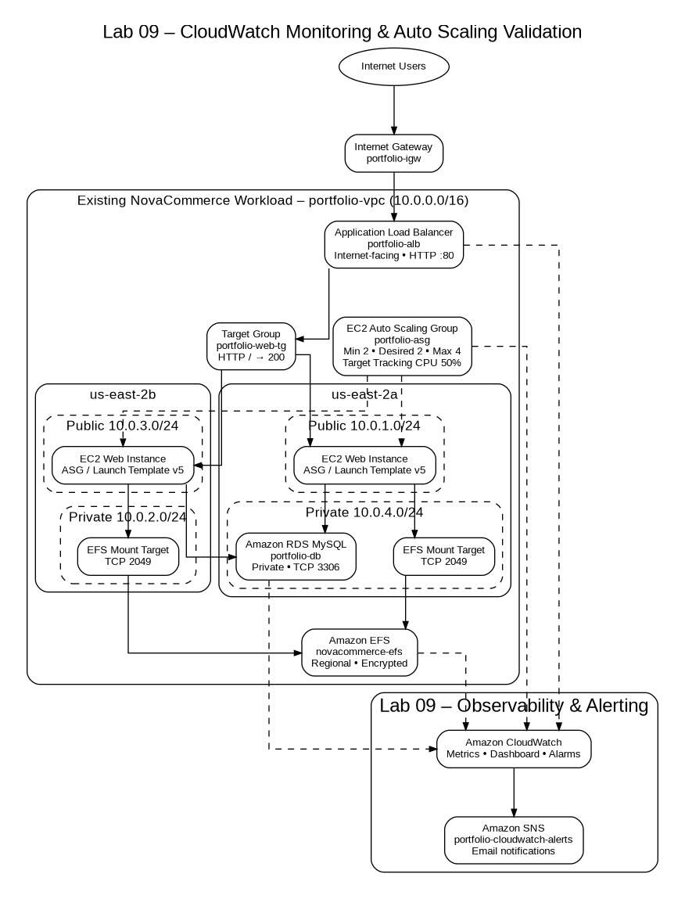

# Lab 09 – Amazon CloudWatch Monitoring, Alarms & Auto Scaling Validation

> **Difficulty:** Intermediate  
> **Category:** Monitoring / DevOps / Reliability  
> **Status:** ✅ Completed  
> **AWS Region:** `us-east-2`  
> **Project:** NovaCommerce

---

# Overview

Lab 09 focuses on **observability, alerting, and operational validation** for the existing NovaCommerce AWS architecture.

The underlying application platform—Amazon VPC, Application Load Balancer, EC2 Auto Scaling, Amazon EFS, and Amazon RDS—was implemented in earlier labs and is **reused** here as the monitored workload. This laboratory adds and validates Amazon CloudWatch metrics, alarms, dashboards, Auto Scaling metrics collection, Amazon SNS notifications, and controlled resilience/scaling tests.

The lab validates both monitoring and behavior under real operational conditions:

- EC2 CPU utilization monitoring.
- ALB request and target-health monitoring.
- CloudWatch alarms for high CPU and loss of healthy targets.
- Amazon SNS email notifications.
- Auto Scaling Group metrics collection.
- CPU Target Tracking validation.
- Controlled scale-out from 2 to 4 instances.
- Automatic scale-in after demand returns to normal.
- Automatic replacement of an unhealthy EC2 instance.
- EFS and RDS monitoring/security validation.
- Final Multi-AZ application availability through the ALB.

---

# Learning Objectives

By completing this laboratory, you will be able to:

- [x] Explore native CloudWatch metrics for EC2, ALB, EFS, RDS, and Auto Scaling.
- [x] Create CloudWatch alarms with static thresholds and evaluation periods.
- [x] Integrate CloudWatch alarms with Amazon SNS notifications.
- [x] Build a centralized CloudWatch monitoring dashboard.
- [x] Enable Auto Scaling Group metrics collection.
- [x] Configure and validate CPU-based Target Tracking.
- [x] Perform controlled scale-out and scale-in testing.
- [x] Validate unhealthy-target detection and automatic EC2 replacement.
- [x] Correlate CloudWatch metrics with ALB, Target Group, ASG, EFS, and RDS behavior.

---

# Business Scenario

NovaCommerce already has a Multi-AZ web architecture, but operating a resilient platform requires more than deploying infrastructure. The operations team needs visibility into workload health, capacity changes, target availability, database resources, and failure events.

Without centralized monitoring and alerting:

- High CPU could go unnoticed.
- A reduction in healthy ALB targets might not be detected quickly.
- Auto Scaling behavior would be difficult to validate.
- Operators would need to manually inspect each AWS service.
- Infrastructure recovery events could occur without timely notification.

Lab 09 solves this operational challenge by adding centralized monitoring, alarm-based alerting, and controlled validation of NovaCommerce elasticity and self-healing behavior.

---

# Solution Overview

The existing NovaCommerce infrastructure is monitored using Amazon CloudWatch. CloudWatch receives native metrics from EC2, ALB, Auto Scaling, EFS, and RDS. Alarms evaluate selected metrics and Amazon SNS sends operational notifications when alarm conditions are met.

```text
Existing NovaCommerce Infrastructure
        │
        ├── Application Load Balancer
        ├── EC2 Auto Scaling Group
        ├── Amazon EFS
        └── Amazon RDS
        │
        ▼
Amazon CloudWatch
        │
        ├── Metrics
        ├── Dashboard
        └── Alarms
              │
              ▼
          Amazon SNS
              │
              ▼
       Email Notification
```

Controlled tests were then used to prove that monitoring reflects actual infrastructure behavior.

---

# AWS Services Used

| AWS Service | Purpose in Lab 09 |
|---|---|
| Amazon CloudWatch | Metrics, dashboards, alarms, and operational visibility |
| Amazon SNS | Email notifications for CloudWatch alarm state changes |
| Amazon EC2 | Source of CPU and status metrics; controlled stress workload |
| EC2 Auto Scaling | Capacity metrics, Target Tracking, scale-out/scale-in, self-healing |
| Application Load Balancer | Request, response-time, and target-health metrics |
| Amazon EFS | Shared-storage metrics and architecture validation |
| Amazon RDS | Database metrics and private-database validation |
| Amazon VPC | Existing monitored network foundation |

---

# Architecture

The diagram below shows the existing NovaCommerce workload and the CloudWatch/SNS monitoring layer added and validated in Lab 09.



## Editable Diagram

```text
diagrams/lab-09-architecture.drawio
```

---

# Existing Infrastructure Reused

The following resources existed before Lab 09 and were reused as monitoring/validation targets:

| Component | Existing Resource |
|---|---|
| VPC | `portfolio-vpc` (`10.0.0.0/16`) |
| Application Load Balancer | `portfolio-alb` |
| Target Group | `portfolio-web-tg` |
| Auto Scaling Group | `portfolio-asg` |
| Launch Template | `portfolio-web-template` |
| ASG Launch Template version in use | `5` |
| Web Security Group | `web-sg` |
| EFS | `novacommerce-efs` |
| RDS | `portfolio-db` |

> The Launch Template itself has an earlier default version visible in the console, while the Auto Scaling Group evidence confirms that **version 5** is the version used by the ASG during this lab.

---

# Network Context

The existing VPC spans two Availability Zones.

```text
us-east-2a
├── Public subnet  10.0.1.0/24
└── Private subnet 10.0.4.0/24

us-east-2b
├── Public subnet  10.0.3.0/24
└── Private subnet 10.0.2.0/24
```

The Auto Scaling Group evidence shows the EC2 web instances are launched in the two **public subnets**. The EFS Mount Targets and private database networking use the private subnet layer.

---

# Implementation

## Phase 1 – Review Native CloudWatch Metrics

Native CloudWatch metrics were reviewed before creating alarms.

Metrics included:

- EC2 `CPUUtilization`.
- ALB `RequestCount`.
- Target Group `HealthyHostCount`.
- Target response time.
- EFS activity and client connections.
- RDS memory, storage, I/O, and network metrics.

This established the baseline observability available without installing an additional agent.

---

## Phase 2 – Create EC2 High CPU Alarm

A CloudWatch alarm was configured for one active web EC2 instance.

| Property | Value |
|---|---|
| Metric | `CPUUtilization` |
| Statistic | Average |
| Period | 5 minutes |
| Threshold | `>= 80%` |
| Datapoints to alarm | `2 of 2` |
| Alarm | `portfolio-ec2-high-cpu` |
| Notification | `portfolio-cloudwatch-alerts` |

Amazon SNS email subscription was confirmed before testing the alarm.

---

## Phase 3 – Validate High CPU Alarm and SNS

A controlled CPU workload was generated on EC2.

```bash
stress-ng --cpu 2 --timeout 600s
```

CloudWatch recorded the increased CPU utilization, the alarm transitioned to `ALARM`, and the SNS notification was delivered.

After the workload ended, CPU utilization returned to normal and the alarm returned to `OK`.

Status: **✅ Validated**

---

## Phase 4 – Create Target Health Alarm

A second alarm monitored Target Group availability.

| Property | Value |
|---|---|
| Metric | `HealthyHostCount` |
| Statistic | Minimum |
| Period | 1 minute |
| Condition | `< 2` |
| Datapoints to alarm | `2 of 2` |
| Alarm | `portfolio-alb-unhealthy-targets` |
| Notification | `portfolio-cloudwatch-alerts` |

---

## Phase 5 – Validate Unhealthy Target Detection and Self-Healing

Apache was stopped on one EC2 instance as a controlled failure test.

```bash
sudo systemctl stop httpd
```

The observed sequence was:

```text
Apache stopped
     │
     ▼
ALB health check failure
     │
     ▼
HealthyHostCount decreases
     │
     ▼
CloudWatch alarm
     │
     ▼
SNS notification
     │
     ▼
Auto Scaling replaces unhealthy EC2
     │
     ▼
Target Group returns to healthy state
```

Status: **✅ Validated**

---

## Phase 6 – Build CloudWatch Monitoring Dashboard

A centralized dashboard was created:

```text
portfolio-monitoring-dashboard
```

The dashboard includes:

- EC2 / ASG CPU utilization.
- ALB request count.
- Healthy Host Count.
- Target response time.

This provides one operational view of the web tier instead of requiring separate navigation through each AWS service.

Status: **✅ Validated**

---

## Phase 7 – Enable Auto Scaling Group Metrics

Auto Scaling Group metric collection was enabled after the Monitoring view initially displayed no data.

This enabled visibility into capacity changes and scaling behavior during the load test.

Status: **✅ Validated**

---

## Phase 8 – Configure CPU Target Tracking

A Target Tracking policy was configured for the existing Auto Scaling Group.

| Property | Value |
|---|---|
| Auto Scaling Group | `portfolio-asg` |
| Policy | `portfolio-asg-cpu-target-tracking` |
| Metric | Average CPU Utilization |
| Target | `50%` |
| Instance warmup | `300 seconds` |
| Minimum | `2` |
| Desired baseline | `2` |
| Maximum | `4` |

Status: **✅ Validated**

---

## Phase 9 – Validate Automatic Scale-Out

CPU stress was executed on the two baseline EC2 instances.

```text
2 EC2 instances
      │
      ▼
Sustained CPU load
      │
      ▼
CPU exceeds target
      │
      ▼
Target Tracking alarm
      │
      ▼
Desired capacity 2 → 4
      │
      ▼
4 InService / Healthy EC2 instances
```

Status: **✅ Validated**

---

## Phase 10 – Validate Automatic Scale-In

After the stress process stopped, desired capacity was **not** changed manually.

The Target Tracking policy was allowed to evaluate the lower CPU demand and reduce capacity automatically.

```text
4 EC2 instances
      │
      ▼
CPU returns to normal
      │
      ▼
Low utilization evaluation
      │
      ▼
Automatic scale-in
      │
      ▼
2 EC2 instances
```

Status: **✅ Validated**

---

## Phase 11 – Validate EFS and RDS Observability

The existing EFS and RDS layers were reviewed as monitored dependencies.

### EFS

Validated:

- Shared storage visible from multiple EC2 instances.
- Regional Mount Targets across `us-east-2a` and `us-east-2b`.
- NFS Security Group control on TCP `2049`.
- EFS monitoring metrics.

### RDS

Validated:

- MySQL TCP `3306` restricted to the web Security Group.
- `Public access: Not publicly accessible`.
- Automated backups.
- RDS monitoring metrics including memory and storage.

---

## Phase 12 – Final Multi-AZ Validation

The ALB DNS endpoint was used to send repeated requests after scaling and recovery tests.

The NovaCommerce validation page showed different EC2 Instance IDs and Availability Zones, confirming that the application remained operational behind the same ALB endpoint.

Status: **✅ Validated**

---

# Repository Structure

```text
09-CLOUDWATCH/
│
├── README.md
├── CHANGELOG.md
├── commands.md
├── interview-questions.md
├── resources.md
├── study-notes.md
├── troubleshooting.md
│
├── architecture/
│   ├── README.md
│   ├── architecture-decisions.md
│   ├── lab-09-architecture.png
│   └── lab-09-architecture.svg
│
├── diagrams/
│   └── lab-09-architecture.drawio
│
├── evidence/
│   ├── README.md
│   └── 39 curated evidence screenshots
│
└── scripts/
    ├── user-data-web-server.sh
    └── cpu-stress-test.sh
```

---

# Validation

## Acceptance Criteria

| Validation | Status |
|---|:---:|
| Native CloudWatch metrics visible | ✅ |
| EC2 high-CPU alarm configured | ✅ |
| SNS email subscription confirmed | ✅ |
| High-CPU alarm triggered by controlled workload | ✅ |
| Target-health alarm configured | ✅ |
| Unhealthy-target alarm triggered | ✅ |
| Automatic EC2 replacement observed | ✅ |
| Target Group recovered to healthy state | ✅ |
| CloudWatch dashboard created | ✅ |
| Auto Scaling Group metrics enabled | ✅ |
| CPU Target Tracking configured | ✅ |
| Automatic scale-out `2 → 4` | ✅ |
| Automatic scale-in `4 → 2` | ✅ |
| EFS monitoring/storage validation | ✅ |
| RDS private access and monitoring validation | ✅ |
| Final Multi-AZ application availability validated | ✅ |

---

# Security Considerations

- RDS remains non-public.
- MySQL TCP `3306` is restricted to the authorized web Security Group.
- EFS NFS TCP `2049` is restricted using `portfolio-efs-sg`.
- SSH access is restricted to trusted administrative IPs.
- EFS encryption is enabled.
- Alarm notifications use an SNS topic rather than embedding credentials or secrets in scripts.
- Repository scripts contain no AWS credentials, private keys, database passwords, or secrets.

---

# Troubleshooting

Detailed troubleshooting is documented in:

```text
troubleshooting.md
```

Key issues included:

- Auto Scaling monitoring initially showing no data.
- Expected delay before scale-out.
- Expected stabilization delay before scale-in.
- Unhealthy target detection.
- Automatic instance replacement timing.
- CloudWatch metric delay after CPU workload changes.
- EFS connectivity checks.
- RDS connectivity/security validation.

---

# Best Practices Demonstrated

- Monitor application and infrastructure health centrally.
- Use alarms on meaningful service indicators, not only raw instance state.
- Integrate alarms with an operational notification channel.
- Validate Auto Scaling with controlled tests instead of assuming configuration works.
- Allow automated scale-in to complete without manual desired-capacity changes.
- Use application-level ALB Health Checks.
- Keep RDS private and restrict database access by Security Group reference.
- Use shared persistent storage for replaceable EC2 capacity.
- Keep evidence focused on distinct technical requirements.

---

# Key Takeaways

- CloudWatch is not just a graphing service; it is part of the feedback loop for operations and Auto Scaling.
- Alarm evaluation periods explain why state changes are not instantaneous.
- Auto Scaling scale-out and scale-in have different timing behavior.
- ALB Health Checks can detect application failures even when EC2 itself is running.
- Auto Scaling can restore unhealthy capacity automatically.
- Monitoring becomes more useful when metrics from multiple AWS services are correlated on one dashboard.
- Operational validation is stronger portfolio evidence than static configuration screenshots alone.

---

# Skills Demonstrated

## Monitoring / DevOps

- Amazon CloudWatch metrics
- CloudWatch dashboards
- CloudWatch alarms
- Amazon SNS notifications
- Controlled load testing
- Alarm-state validation
- Operational troubleshooting

## AWS Compute

- EC2 monitoring
- EC2 Auto Scaling
- Target Tracking
- Scale-out / scale-in
- Automatic instance replacement

## Networking / Availability

- ALB metrics
- Target Group Health Checks
- Multi-AZ validation

## Storage / Database Observability

- Amazon EFS monitoring
- Amazon RDS monitoring
- Private database validation

## Linux

- Apache service control
- `stress-ng`
- `top`
- `curl`
- EFS filesystem validation

---

# References

Official documentation and study links are maintained in:

```text
resources.md
```

---

# Final Result

Lab 09 adds a tested monitoring and alerting layer to the existing NovaCommerce architecture and proves that CloudWatch reflects real infrastructure behavior during both load and failure scenarios.

The validated operational lifecycle includes:

```text
Normal workload
      ↓
CloudWatch monitoring
      ↓
CPU increase / target failure
      ↓
CloudWatch alarm
      ↓
SNS notification
      ↓
Auto Scaling reaction
      ↓
Capacity recovery / normalization
      ↓
CloudWatch returns to healthy state
```

**Lab Status: ✅ Completed**
