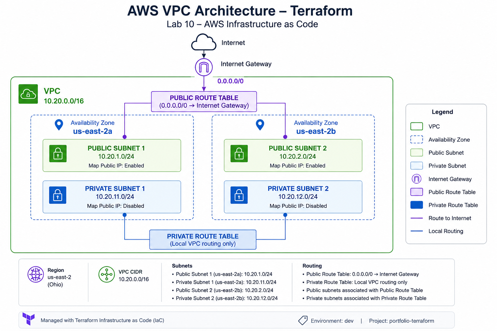

# 🏗️ Lab 10 — AWS Infrastructure as Code with Terraform

## 📌 Overview

This laboratory demonstrates the design, deployment, and validation of AWS network infrastructure using **Terraform Infrastructure as Code (IaC)**.

The objective is to move from manually created cloud infrastructure toward a **reproducible, modular, version-controlled, and automated infrastructure deployment model**.

The laboratory implements a custom AWS VPC architecture across multiple Availability Zones using reusable Terraform modules.

---

## 🎯 Objectives

The main objectives of this laboratory are:

- Configure Terraform for AWS.
- Authenticate Terraform with AWS using AWS CLI credentials.
- Configure the AWS provider.
- Build reusable Terraform modules.
- Deploy a custom Amazon VPC.
- Create public and private subnets.
- Distribute subnets across multiple Availability Zones.
- Configure an Internet Gateway.
- Configure public and private route tables.
- Associate subnets with their corresponding route tables.
- Apply standardized resource tagging.
- Validate infrastructure using Terraform and AWS CLI.
- Verify Terraform state synchronization and idempotency.
- Document deployment evidence and troubleshooting.

---

## 🏗️ Architecture

The laboratory deploys a custom multi-AZ AWS VPC architecture using reusable Terraform modules.



### Network Architecture

The infrastructure deployed in this laboratory includes:

| Component | Configuration |
|---|---|
| AWS Region | `us-east-2` (Ohio) |
| VPC | `10.20.0.0/16` |
| Availability Zones | `us-east-2a`, `us-east-2b` |
| Public Subnet 1 | `10.20.1.0/24` |
| Public Subnet 2 | `10.20.2.0/24` |
| Private Subnet 1 | `10.20.11.0/24` |
| Private Subnet 2 | `10.20.12.0/24` |
| Internet Gateway | Attached to the VPC |
| Public Route Table | `0.0.0.0/0 → Internet Gateway` |
| Private Route Table | Local VPC routing only |
| Provisioning | Terraform Infrastructure as Code |

The public subnets are associated with the public route table and have a route to the Internet Gateway.

The private subnets are associated with a dedicated private route table and intentionally have no direct Internet route in the current laboratory.

> **Design decision:** A NAT Gateway is intentionally not deployed in this lab. The objective is to demonstrate VPC segmentation, routing, multi-AZ design, Terraform modularization, and Infrastructure as Code fundamentals while keeping the architecture focused and cost-conscious.

For the complete architecture documentation, see:

➡️ [AWS VPC Architecture — Terraform](architecture/terraform-vpc-architecture.md)

---

## ☁️ AWS Infrastructure

| Component | Configuration |
|---|---|
| Cloud Provider | Amazon Web Services |
| Region | `us-east-2` |
| Environment | `dev` |
| VPC | Custom VPC |
| VPC CIDR | `10.20.0.0/16` |
| Availability Zones | `us-east-2a`, `us-east-2b` |
| Public Subnets | 2 |
| Private Subnets | 2 |
| Internet Gateway | 1 |
| Public Route Table | 1 |
| Private Route Table | 1 |
| Infrastructure Management | Terraform |

---

## 🌐 Network Segmentation

The infrastructure separates resources into **public and private network tiers**.

| Type | Availability Zone | CIDR | Public IP |
|---|---|---|---|
| Public | us-east-2a | `10.20.1.0/24` | Enabled |
| Public | us-east-2b | `10.20.2.0/24` | Enabled |
| Private | us-east-2a | `10.20.11.0/24` | Disabled |
| Private | us-east-2b | `10.20.12.0/24` | Disabled |

This architecture provides the foundation for deploying workloads using network segmentation and multiple Availability Zones.

---

## 🧱 Terraform Project Structure

```text
10-TERRAFORM/
│
├── architecture/
├── evidence/
│
├── terraform/
│   │
│   ├── environments/
│   │   └── dev/
│   │       ├── .terraform.lock.hcl
│   │       ├── main.tf
│   │       ├── outputs.tf
│   │       ├── providers.tf
│   │       ├── terraform.tfvars.example
│   │       └── variables.tf
│   │
│   └── modules/
│       └── vpc/
│           ├── main.tf
│           ├── outputs.tf
│           └── variables.tf
│
├── commands.md
├── interview-questions.md
├── README.md
├── study-notes.md
├── troubleshooting.md
└── validation.md
```

---

# ⚙️ Terraform Workflow

## 1. Initialize Terraform

```bash
terraform init
```

Terraform initializes the working directory and downloads the required AWS provider.

---

## 2. Format Terraform Configuration

```bash
terraform fmt -recursive
```

This ensures consistent Terraform code formatting.

---

## 3. Validate Configuration

```bash
terraform validate
```

Expected result:

```text
Success! The configuration is valid.
```

---

## 4. Review Infrastructure Plan

```bash
terraform plan
```

During the initial deployment Terraform calculated:

```text
Plan: 13 to add, 0 to change, 0 to destroy.
```

This allowed the infrastructure changes to be reviewed before deployment.

---

## 5. Create a Saved Plan

```bash
terraform plan -out="tfplan"
```

The generated plan can then be applied exactly as reviewed.

---

## 6. Deploy Infrastructure

```bash
terraform apply "tfplan"
```

Initial deployment result:

```text
Apply complete! Resources: 13 added, 0 changed, 0 destroyed.
```

---

# 📦 Terraform Outputs

Outputs were configured to expose important infrastructure identifiers.

Example:

```text
internet_gateway_id
private_route_table_id
private_subnet_ids
public_route_table_id
public_subnet_ids
vpc_id
```

These outputs can later be consumed by additional Terraform modules.

---

# 🔎 AWS CLI Validation

Terraform deployment was independently validated against AWS using the AWS CLI.

## VPC Validation

The deployed VPC was queried using AWS CLI.

Validated configuration:

```text
CIDR: 10.20.0.0/16
State: available
```

---

## Subnet Validation

AWS CLI validation confirmed four subnets distributed across two Availability Zones.

```text
us-east-2a
├── Public  10.20.1.0/24
└── Private 10.20.11.0/24

us-east-2b
├── Public  10.20.2.0/24
└── Private 10.20.12.0/24
```

Public subnets automatically assign public IPv4 addresses.

Private subnets do not.

---

## Route Table Validation

Two route tables were validated:

```text
portfolio-terraform-dev-public-rt
portfolio-terraform-dev-private-rt
```

The public subnets are associated with the public route table.

The private subnets are associated with the private route table.

---

## 🌍 Internet Route Validation

The public route table contains:

```text
10.20.0.0/16 → local
0.0.0.0/0    → Internet Gateway
```

Both routes were validated with state:

```text
active
```

This confirms that the public network tier has a route for Internet-bound traffic through the Internet Gateway.

---

# 🔁 Idempotency Validation

After deployment, Terraform was executed again using:

```bash
terraform plan
```

Terraform returned:

```text
No changes. Your infrastructure matches the configuration.
```

This demonstrates an important Infrastructure as Code property:

**Idempotency**

Running Terraform against infrastructure already matching the desired configuration does not generate unnecessary changes.

---

# 🏷️ Resource Tagging

Resources were created with standardized tags such as:

```text
Environment = dev
ManagedBy   = Terraform
Project     = portfolio-terraform
Repository  = aws-cloud-devops-portfolio
```

This improves:

- resource identification,
- infrastructure governance,
- operational management,
- environment separation,
- and future cost allocation.

---

# 📸 Evidence

The laboratory contains technical evidence of both Terraform execution and AWS infrastructure validation.

| Evidence | Description |
|---|---|
| `01-terraform-init-validation.png` | Terraform initialization |
| `02-terraform-plan-13-resources.png` | Initial infrastructure plan |
| `03-terraform-apply-and-state.png` | Infrastructure deployment and state |
| `04-terraform-outputs-idempotency.png` | Terraform outputs and idempotency |
| `05-aws-cli-vpc-validation.png` | AWS VPC validation |
| `06-aws-cli-subnets-validation.png` | AWS subnet validation |
| `07-aws-cli-route-tables-validation.png` | Route table validation |
| `08-aws-cli-public-route-internet-validation.png` | Internet Gateway route validation |
| `09-aws-cli-public-subnet-associations.png` | Public subnet associations |
| `10-aws-cli-private-subnet-associations.png` | Private subnet associations |

---

# 🔐 Terraform State & Repository Security

Terraform state files are intentionally excluded from version control.

The repository ignores:

```text
.terraform/
*.tfstate
*.tfstate.*
tfplan
*.tfvars
```

Terraform state may contain infrastructure metadata or sensitive values and should not be committed to a public Git repository.

The following file **is version controlled**:

```text
.terraform.lock.hcl
```

This ensures consistent provider dependency selection.

A safe configuration template is also maintained:

```text
terraform.tfvars.example
```

---

# 🧠 Key Concepts Practiced

This laboratory provides practical experience with:

- Infrastructure as Code
- Terraform providers
- Terraform modules
- Terraform variables
- Terraform outputs
- Terraform state
- Terraform dependency management
- Terraform plan/apply lifecycle
- Terraform idempotency
- Amazon VPC
- CIDR addressing
- Multi-AZ networking
- Public/private subnet segmentation
- Internet Gateways
- Route tables
- Route table associations
- AWS CLI
- Infrastructure validation
- Resource tagging
- Git repository security

---

# 🛠️ Troubleshooting Experience

During implementation, several real-world issues were identified and resolved.

Examples include:

### Terraform CLI not available in PATH

Terraform was initially not recognized by PowerShell.

The Terraform executable was installed and configured in the Windows PATH.

### AWS CLI credentials unavailable

Terraform initially returned:

```text
No valid credential sources found
```

AWS authentication was restored using:

```bash
aws login
```

and verified with:

```bash
aws sts get-caller-identity
```

### Expired AWS login session

Terraform reported an expired login session while generating a plan.

Reauthentication through AWS CLI resolved the issue.

### Terraform saved plan became stale

After infrastructure state changed, attempting to reuse an older saved plan returned:

```text
Saved plan is stale
```

A new Terraform plan was generated instead of reusing the obsolete plan.

These scenarios are documented in greater detail in:

```text
troubleshooting.md
```

---

# 💼 Engineering Skills Demonstrated

This laboratory provides technical evidence relevant to:

**Cloud Engineer**
- AWS infrastructure deployment
- VPC networking
- AWS CLI

**DevOps Engineer**
- Infrastructure as Code
- Terraform workflows
- Git-based infrastructure management

**Infrastructure Engineer**
- Network segmentation
- Routing
- Multi-AZ infrastructure

**Site Reliability Engineer**
- Infrastructure validation
- reproducibility
- state consistency
- troubleshooting

**Solutions Architect**
- AWS network architecture
- subnet design
- infrastructure modularization

---

# 🚧 Next Improvements

This laboratory will continue evolving with additional infrastructure capabilities.

Planned improvements include:

- Security Groups as Code
- EC2 deployment using Terraform
- IAM Roles and Instance Profiles
- Application Load Balancer
- Auto Scaling
- Remote Terraform state
- S3 backend
- Terraform state locking
- CI validation for Terraform
- Security scanning
- Multi-environment architecture
- Production-oriented infrastructure patterns

---

# 📚 Related Documentation

- [Terraform Validation](validation.md)
- [Commands](commands.md)
- [Study Notes](study-notes.md)
- [Troubleshooting](troubleshooting.md)
- [Interview Questions](interview-questions.md)

---

## 📌 Lab Status

**Status:** Infrastructure deployed and validated ✅

**Environment:** Development

**Region:** `us-east-2`

**Infrastructure:** AWS VPC networking using Terraform

---

> This laboratory is part of the AWS Cloud, DevOps & Infrastructure Engineering Portfolio and documents practical Infrastructure as Code implementation using Terraform and Amazon Web Services.